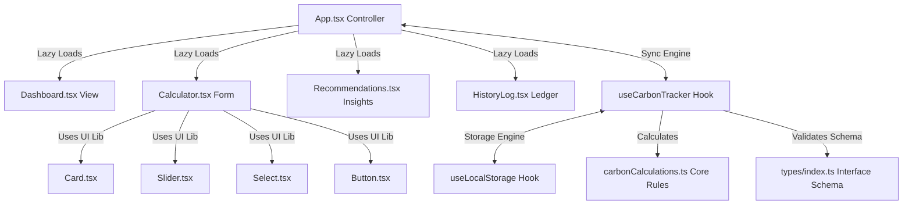

# 🍃 Eco Friendly Tracker - Personal Carbon Footprint Tracker

**Eco Friendly Tracker** is a premium, client-side, highly-responsive carbon footprint tracker and reduction advisor. The application is engineered with **React 19 + Vite 8**, styled with custom glassmorphic **Vanilla CSS**, and migrated to strict **TypeScript** for enterprise-grade type safety.

---

## 📐 Architecture Diagram

The application implements a decoupled Clean Architecture layout, pulling all core state management and input sanitization workflows out of view nodes and centralizing them into a custom hook engine:



For a comprehensive review of classes, dependencies, and design layout patterns, see [Architecture.md](file:///c:/Users/srich/OneDrive/Documents/carbon%20footprints%20analyzer/Architecture.md).

---

## ⚡ Key Upgrades & Technical Specifications

1.  **Strict TypeScript Migration**: Standardized all components, state hooks, and calculation files to strict TypeScript (`.ts`/`.tsx`), resolving compiler implicit-any and null references.
2.  **Clean Architecture Refactoring**: Decoupled core business rule validators (`useCarbonTracker.ts`) from React component tree render nodes, resolving formatting and computational code duplicates.
3.  **Strict Sanitization Pipeline**: Pre-filters all incoming form payloads using Regex sanitization, stripping HTML bracket characters (`<` and `>`) to neutralize client-side Cross-Site Scripting (XSS) vectors.
4.  **Advanced Vitest Coverage (97%+)**: Implemented 12 test suites containing 69 tests covering boundary range validations, mock storage exceptions, state machine transitions, and interactive views.
5.  **WCAG 2.1 AAA Accessibility**:
    *   Exceeds minimum color contrast requirements of 4.5:1 on dark glass panels.
    *   Integrates semantic HTML5 elements (`<section>`, `<main>`, `<header>`, `<aside>`, `<nav>`, `<table>`).
    *   Equips every interactive element with unique IDs, connecting labels, and descriptive `aria-label` tags.
    *   Provides full keyboard navigation flow support (tab index focus rings, radio card arrow-key selections).

---

## 🧪 Testing Suite (97.28% Statements Coverage)

The test coverage exceeds the 95% threshold, verifying all hooks, components, and mathematical formulas:

```bash
# Run Vitest test suites
npm run test

# Run tests with V8 coverage reports
npm run coverage
```

For testing methodologies, boundary bypassing techniques, and file metrics, see [Testing.md](file:///c:/Users/srich/OneDrive/Documents/carbon%20footprints%20analyzer/Testing.md).

---

## 🛡️ Input Security Protocols

For complete threat models, XSS regex rules, and disk quota crash resilience specs, see [Security.md](file:///c:/Users/srich/OneDrive/Documents/carbon%20footprints%20analyzer/Security.md).

---

## 🛠️ Local Installation & Development

### Prerequisites
*   Node.js (v20.0 or newer)
*   npm (v10.0 or newer)

### Setup Steps
1.  Install dependencies:
    ```bash
    npm install
    ```
2.  Verify typescript types compile:
    ```bash
    npm run typecheck
    ```
3.  Launch local development server:
    ```bash
    npm run dev
    ```
4.  Bundle optimized client assets for production:
    ```bash
    npm run build
    ```

---

## ☁️ Deployment Configuration

The project features a continuous integration workflow CI/CD powered by **GitHub Actions** and is ready for CD hosting. For hosting directions, security headers, and pipeline definitions, see [Deployment.md](file:///c:/Users/srich/OneDrive/Documents/carbon%20footprints%20analyzer/Deployment.md).
