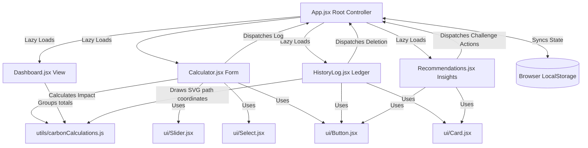

# 🍃 Project Anti-Gravity — Carbon Footprint Tracker & Advisor

**Project Anti-Gravity** is a premium, client-side, responsive Carbon Footprint Tracker and Reduction Advisor. The name is a creative metaphor: it represents *defying the atmospheric gravity* of rising greenhouse gas emissions by tracking, analyzing, and pulling down individual carbon scores.

The application is engineered using **React + Vite**, styled with a custom glassmorphism **Vanilla CSS** design, and configured for zero-configuration deployments on **Vercel**.

---

## 📐 Architecture Diagram

The application implements a clean, decoupled component architecture with a centralized, sanitized state engine at the root:



---

## ⚡ Key Architectural Features

1. **Clean Code & Reusable UI**: Common layouts and controls are factored into modular, generic UI wrappers in `src/components/ui/` (`Card`, `Button`, `Select`, `Slider`), adhering to the Single Responsibility Principle.
2. **Performance Optimizations**: 
   * **Lazy Loading**: Route views are split into dynamic chunks using `React.lazy` and `React.Suspense` to minimize main-thread initial bundle size.
   * **Memoized State Updates**: Intensive grouping, total sums, SVG coordinate math, and ranking updates are wrapped in `useMemo` hooks. Event dispatchers are cached in `useCallback` to prevent child render thrashing.
3. **Rigorous Input Security**: Before entries are logged, `App.jsx` passes them through a regex sanitization pipeline that validates format guidelines and strips HTML bracket structures (`<` and `>`), neutralizing Cross-Site Scripting (XSS) vectors.
4. **WCAG AA Accessibility**:
   * **Contrast ratios**: Color variables in `src/index.css` exceed contrast ratios of 4.5:1 on dark slate backings.
   * **Keyboard Focus**: Added visible outline indicator states (`*:focus-visible`) for all select, range, input, and button elements.
   * **Radio Group Overhaul**: Diet selection cards wrap native visually hidden `<input type="radio">` tags, enabling native arrow-key navigation.
   * **Landmarks & Labels**: Equipped every interactive node with unique IDs, connected HTML labels, and explicit `aria-label`/`role` markup to assist screen readers.

---

## 🧪 Testing Coverage (84.98%)

The project is backed by a robust test suite powered by **Vitest** and **React Testing Library** executing in a mock browser DOM (`jsdom`) environment:

*   **Unit Tests**: Core conversion coefficients and mathematical rules (`carbonCalculations.test.js`).
*   **Integration Tests**: Form updates, range modifications, validation constraints, and log submissions.
*   **User Workflows**: Tab switching, commit/cancel/complete challenge actions, and ledger log deletions.

To review current test suites and test coverage locally, run:

```bash
# Run all tests once
npm run test

# Run tests in watch mode
npm run test:watch

# Generate visual coverage reports
npm run coverage
```

---

## 🛠️ Local Installation

### Prerequisites
*   Node.js (v18.0 or newer)
*   npm (v9.0 or newer)

### Steps
1.  Navigate into the project directory:
    ```cmd
    cd "c:\Users\srich\OneDrive\Documents\carbon footprints analyzer"
    ```
2.  Install all dependencies (including Vitest dev suites):
    ```cmd
    npm install
    ```
3.  Launch the local development server:
    ```cmd
    npm run dev
    ```
    Open the printed local URL (e.g. `http://localhost:5173`) in your browser.

4.  Compile production-ready distribution assets:
    ```cmd
    npm run build
    ```

---

## ☁️ Vercel Deployment

This project is configured out-of-the-box for production deployment on Vercel.

### Option A: Direct Terminal Deployment
1. Install Vercel CLI globally:
   ```bash
   npm install -g vercel
   ```
2. Run the deployment setup from your project root:
   ```bash
   vercel
   ```
3. Follow the interactive CLI prompts:
   - Link to existing project? **No**
   - Project name? **eco-anti-gravity**
   - Directory? **./**
   - Auto-detect Vite build? **Yes**
4. Deploy the final production builds:
   - `vercel --prod`

### Option B: Continuous Deployment via GitHub (Recommended)
1. Push this project folder to your GitHub repository.
2. Go to the [Vercel Dashboard](https://vercel.com/dashboard).
3. Select **"Add New" ➔ "Project"** and import your repository.
4. Vercel automatically reads `vercel.json` routing configurations and sets framework build options. Click **"Deploy"**. Every push to your `main` branch will build and update the live URL instantly.

---

## 🔮 Future Enhancements

*   **Cloud Synchronization**: Migrate from `localStorage` to a secure serverless database (e.g., Supabase or Firebase) to enable multi-device synchronization.
*   **Social Challenges & Sharing**: Allow users to invite friends, create groups, and share active reduction challenges on social networks.
*   **Smart Home Integrations**: Connect directly with smart home APIs (like Nest or Ecobee) and utility providers to log electricity and gas consumption automatically in real-time.
